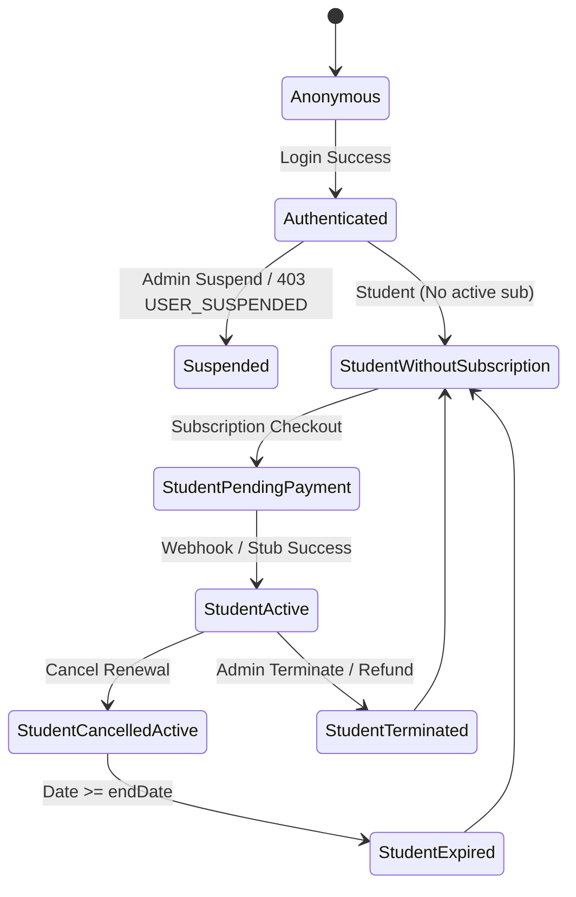

# Frontend MVP Implementation Plan

This document details the frontend implementation strategy for integrating with the Spring Boot backend MVP.

---

## 1. Project Assumptions

*   **API Protocol:** The backend is a Spring Boot REST API.
*   **Authentication:** JWT authentication (`accessToken` and `refreshToken`). The `accessToken` is sent in the header as `Authorization: Bearer <accessToken>`.
*   **Access Control:** The backend is the source of truth for authorization, subscription status, and booking/message gates. UI-level blocking is strictly for user experience; backend validations represent the ultimate security authority.
*   **Roles:** Three user roles exist: `STUDENT`, `COACH`, and `ADMIN`.
*   **Payment Flow:** Initiated via the frontend calling the checkout endpoint to retrieve an Iyzico `checkoutUrl`. The payment form is loaded, and payment completion triggers an asynchronous backend webhook.
*   **Webhook Asynchrony:** The Iyzico webhook is provider-triggered and goes directly to the backend. The frontend is not responsible for notifying the backend of payment success; it must poll or refresh context to detect active status.

---

## 2. Frontend Phases

### FE Phase 0 — Project Setup & API Client Foundation
*   **Routing Structure:** SPA routing (e.g., React Router, Vue Router) with lazy loading for feature modules.
*   **Auth Token Storage:** Store JWT tokens securely. Implement client storage logic with auto-refresh mechanism on expiry.
*   **API Client Wrapper:** An HTTP client wrapper (e.g. Axios instance) that automatically appends the `Authorization: Bearer <token>` header to outgoing requests and intercept `401` errors to attempt token refresh.
*   **Global Error Handler:** A unified HTTP interceptor parsing standard problem details (`application/problem+json`) to display toast alerts or system messages.
*   **Role-Based Route Guard:** Route guards restricting routes based on roles (`STUDENT`, `COACH`, `ADMIN`) in the user's JWT payload.
*   **Environment Variables:** Maintain `VITE_API_BASE_URL` or equivalent configurations to target different backend profiles.

### FE Phase 1 — Auth & User Session
*   **Login Page:** Form collecting email and password, submitting to `POST /api/v1/auth/login`.
*   **Register Page:** Form collecting email, password, fullName, and role, submitting to `POST /api/v1/auth/register`.
*   **Current User/Me Loading:** Upon startup or token load, call `GET /api/v1/auth/me` to populate the global user store.
*   **Logout:** Trigger `POST /api/v1/auth/logout` to notify the server, clean local storage tokens, and redirect to login.
*   **Suspended User Error Handling:** If `GET /api/v1/auth/me` or `/login` returns `403 Forbidden` with the code `USER_SUSPENDED`, redirect directly to the `/suspended` screen.
*   **401/403 Behavior:** Clear session and redirect to `/login` for unresolvable 401s; show a "Not Authorized" overlay for 403s.

### FE Phase 2 — Student Dashboard Shell
*   **Student Home:** Personalized workspace containing notifications, quick booking access, and current coach session logs.
*   **Current Subscription Status:** Call `GET /api/v1/subscriptions/me` to read active subscription parameters.
*   **Payment State Badges:** Visual status indicator displaying `ACTIVE`, `PENDING_PAYMENT`, `EXPIRED`, `REFUNDED`, or `TERMINATED`.
*   **PENDING_PAYMENT Warning UI:** Large yellow alert banner: *"Ödeme işleminiz bekleniyor. Randevu alabilmek ve mesajlaşabilmek için lütfen ödemeyi tamamlayın."*
*   **ACTIVE Subscription UI:** Normal dashboard with navigation controls enabled.

### FE Phase 3 — Coach Discovery & Package Selection
*   **Coach Listing:** Grid/list rendering approved coaches using `GET /api/v1/coaches`. Includes filters for track and university name.
*   **Coach Detail Page:** Shows coach biography, university, track, description, and slot selection calendars (`GET /api/v1/coaches/{id}`).
*   **Package Selection:** Render active subscription packages loaded via `GET /api/v1/packages`.
*   **Pre-Check Before Checkout:** Verify in the UI that the coach has available capacity and the student has no active subscriptions before proceeding to checkout.

### FE Phase 4 — Subscription Checkout & Payment State
*   **Checkout Button:** Triggers payment checkout in the coach/package purchase form.
*   **POST /api/v1/subscriptions/checkout:** Initiates transaction and fetches the Iyzico `checkoutUrl` and `checkoutToken`.
*   **Redirect/Open checkoutUrl:** Load the checkout URL inside an iframe overlay or redirect current window to payment gateway.
*   **Show PENDING_PAYMENT State:** Transition UI to pending state, hiding purchase actions.
*   **Handle Duplicate Pending Checkout:** If checkout returns a message that a pending payment exists, offer to redirect them to the existing invoice/checkout URL.
*   **Payment Status Refresh Strategy:** Implement a polling loop on `GET /api/v1/subscriptions/me` (e.g., polling every 3 seconds up to 5 attempts) to detect when the status transitions to `ACTIVE` after webhook completion.
*   **Stub Payment Success:** Display a dev-only button to call `POST /api/v1/payments/{paymentId}/stub/succeed` for local environment testing.

### FE Phase 5 — Booking & Messaging Gates
*   **Disable Booking if no ACTIVE subscription:** Disable slot click actions and booking forms if the active subscription is missing, pending, or terminated.
*   **Disable Messaging if no ACTIVE subscription:** Disable messaging textarea inputs and WebSocket connection requests.
*   **Graceful Backend Error Rendering:** Render custom error logs when backend gate filters return errors (e.g. session weekly quota limits).

### FE Phase 6 — Subscription Management
*   **Cancel Renewal Button:** Displays next to active subscriptions where `autoRenew` is `true`.
*   **Confirmation Modal:** Warns student that renewal cancellation will not end active access immediately, but rather stop billing at the end of the term.
*   **Show Access Remains Until endAt:** Display warning: *"Erişiminiz {endDate} tarihine kadar devam edecektir."*
*   **Show autoRenew=false State:** Change active status layout to show "Otomatik yenileme kapalı".
*   **Cancel-Renewal vs. Admin Termination:** Highlight that cancellation maintains access until the term ends, whereas termination immediately revokes all access.

### FE Phase 7 — KVKK Consent & Safety Report UX
*   **Consent Modal/Page:** Overlay blocking access until consent types (KVKK, TERMS) are accepted.
*   **POST /api/v1/consents:** Record accepted policies.
*   **documentVersion Strategy:** Pass exact document version (e.g. `v1.0`) in the consent requests.
*   **Report User/Conversation/Message:** Launch dialog next to student cards or chat headers.
*   **POST /api/v1/reports:** Send safety tickets to the backend.

### FE Phase 8 — Admin Safety Panel
*   **Admin Report List:** Grid displaying all reports from `GET /api/v1/admin/reports`.
*   **Report Status Display:** Shows badges for `OPEN`, `RESOLVED`, etc.
*   **User Suspend Action:** Prominent button to call `POST /api/v1/admin/users/{id}/suspend` with a reason.
*   **Admin Conversation Access Reason Modal:** Prompt for viewing chat logs.
*   **Conversation Access Audit Logging:** Call `POST /api/v1/admin/conversations/{conversationId}/access-log` prior to loading chat messages.

### FE Phase 9 — Admin Finance & Intervention Panel
*   **Admin Refund Action:** Call `POST /api/v1/admin/payments/{paymentId}/refund` with refund amount and reason inputs.
*   **Admin Subscription Terminate Action:** Call `POST /api/v1/admin/subscriptions/{id}/terminate` with a reason.
*   **UI Warning:** Display clear warnings that termination instantly blocks student access and frees coach capacity.
*   **Show Refund/Terminate Results:** Refresh payment and subscription lists.

### FE Phase 10 — Iyzico Sandbox & End-to-End QA
*   **Sandbox Checkout Test:** QA workflows validating checkout using sandbox test cards.
*   **checkoutUrl Open Behavior:** Ensure browser successfully opens external secure checkouts.
*   **Webhook Localhost Limit Note:** Document that webhooks require public endpoints or reverse proxy configurations (ngrok) during local execution.

---

## 3. Recommended Route Map

*   `/login` - Login page
*   `/register` - User registration
*   `/dashboard` - Student/Coach landing dashboard
*   `/coaches` - Browse approved coaches
*   `/coaches/:id` - Coach details & schedule availability list
*   `/subscriptions` - Manage subscriptions and billing histories
*   `/messages` - Chat conversations panel
*   `/admin/reports` - Oversight safety ticket lists (Admin only)
*   `/admin/users/:id` - User profile oversight/suspend actions (Admin only)
*   `/admin/subscriptions/:id` - Subscription status/termination options (Admin only)
*   `/admin/conversations/:id` - Chat logs viewer after audit reasons input (Admin only)

---

## 4. API Integration Table

| UI Feature | Backend Endpoint | Method | Required Role | Request Body | Expected State Changes | Error Notes |
| :--- | :--- | :--- | :--- | :--- | :--- | :--- |
| Login | `/api/v1/auth/login` | `POST` | Public | `LoginRequest` | Session active, store JWTs | `401` on invalid credentials |
| Register | `/api/v1/auth/register` | `POST` | Public | `RegisterRequest` | Navigate to login or auto-login | `400` on validation errors |
| Profile | `/api/v1/auth/me` | `GET` | Authenticated | None | Populate global user context | `403 USER_SUSPENDED` -> redirect |
| Checkout | `/api/v1/subscriptions/checkout` | `POST` | `STUDENT` | `SubscriptionCreateRequest` | Create pending payment, load iframe | `400` on coach capacity limit |
| Cancel Renewal | `/api/v1/subscriptions/{id}/cancel-renewal` | `POST` | `STUDENT` | None | Update `autoRenew` to `false` | `403` if not owner |
| Stub Success | `/api/v1/payments/{paymentId}/stub/succeed` | `POST` | `STUDENT` | None | Transition status to `ACTIVE` | Dev-only tool |
| Record Consent | `/api/v1/consents` | `POST` | Authenticated | `ConsentCreateRequest` | Mark user consent recorded | Check document version mismatch |
| Create Report | `/api/v1/reports` | `POST` | Authenticated | `ReportCreateRequest` | Submit report, close popup | Validate fields |
| Suspend User | `/api/v1/admin/users/{id}/suspend` | `POST` | `ADMIN` | `SuspendRequest` | Mark user `SUSPENDED` | Block action if already suspended |
| Terminate Subscription | `/api/v1/admin/subscriptions/{id}/terminate` | `POST` | `ADMIN` | `AdminSubscriptionTerminateRequest` | Mark subscription `TERMINATED` | Capacity released |

---

## 5. State Model

---

## 6. Error Handling Standards

*   **400 Bad Request:** Form validation errors. Loop over field errors and bind messages below respective form controls.
*   **401 Unauthorized:** JWT token expired. Intercept HTTP response, attempt silent token refresh. If refresh fails, purge tokens and redirect to `/login`.
*   **403 Forbidden (`USER_SUSPENDED`):** Suspended user block. Instantly redirect to `/suspended` screen.
*   **404 Not Found:** Invalid routes or entities. Display static `404 Not Found` screen.
*   **409 Conflict:** Double-booking error. Display error toast: *"Bu saat dilimi dolu, lütfen başka bir uygunluk seçin."*
*   **Network Error:** Backend down. Display banner: *"Sunucu ile bağlantı kurulamadı. Lütfen internet bağlantınızı kontrol edin."*

---

## 7. Suggested Implementation Order

1.  **API Client & Auth:** Setup axios, login, register, token refresh, route guards.
2.  **Dashboard Shell:** Layout, user store, navigation structure.
3.  **Checkout:** Connect coach details, packages, and call checkout to render payment iframe.
4.  **Subscription Status UI:** Check and display active subscriptions, pending payment alerts.
5.  **Booking/Message Gating:** Restrict schedule calendar, socket connections.
6.  **Consent & Report:** Construct consent validation overlay, safety violations report forms.
7.  **Admin Safety:** Report grids, audit log reasons prompts, suspend actions.
8.  **Admin Finance/Intervention:** Terminate subscriptions, issue payments refunds.
9.  **Sandbox QA:** E2E test runs verifying full client flows.

---

## 8. Open Questions for Backend Review

*   **Endpoints:** Verify exact path routes for coach search lists.
*   **Package Details:** Confirm exact structure returned by active package listings.
*   **WebSocket/STOMP:** Determine if subscription topic requires additional variables inside dynamic paths.
*   **Suspended Response:** Confirm that JWT payload contains active flag for quick client checks without calling `/me` constantly.
*   **Refund Limits:** Clarify if partial refunds are supported by Iyzico client setup.
